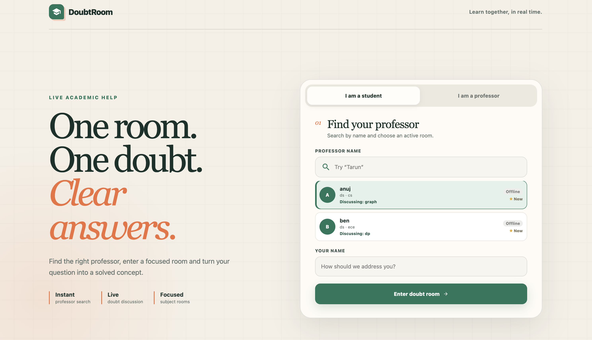
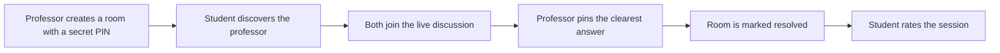
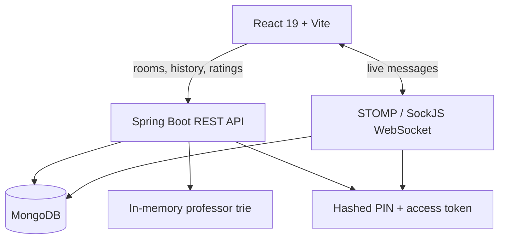

<p align="center">
  
</p>

<p align="center">
  <strong>Turn questions into clear answers, together.</strong><br />
  A focused real-time learning space where students discover professors, join live doubt rooms, and leave with a pinned final answer.
</p>

<p align="center">
  <a href="https://github.com/enlighttarunkumar/Real_time_chat_apk/stargazers"></a>
  
  
  
  
</p>

<p align="center">
  <a href="https://real-time-chat-apk-4.onrender.com">
    
  </a>
</p>

---

## What is DoubtRoom?

DoubtRoom is a full-stack academic chat application designed around one simple idea: each room should solve one doubt well. Professors host protected, subject-specific rooms, students find the right professor through fast prefix search, and both sides collaborate over a live WebSocket connection.

The conversation ends with a useful outcome—not just a closed chat. A professor can pin the clearest response as the final answer, resolve the room, and receive a student rating.

## Highlights

| Discover | Discuss | Resolve |
| :--- | :--- | :--- |
| Search professors by name with trie-backed prefix matching | Exchange messages instantly with STOMP over SockJS | Pin the best answer and mark the doubt as resolved |
| See topic, subject, department, availability, and ratings | Keep room history in MongoDB | Let students rate the completed session |
| Join as a student or securely rejoin as a professor | Protect professor actions with rotating access tokens | Preserve the final answer at the top of the conversation |

## How it works



## Architecture



## Tech stack

| Layer | Technology |
| :--- | :--- |
| Frontend | React 19, Vite 7, React Router, Axios, React Hot Toast |
| Styling | Responsive custom CSS with a warm editorial design system |
| Realtime | STOMP over SockJS and Spring WebSocket |
| Backend | Java 17, Spring Boot 3.5, Spring Data MongoDB |
| Data | MongoDB / MongoDB Atlas |
| Search | Custom trie with availability- and rating-aware results |
| Security | PBKDF2-HMAC-SHA256 PIN hashes and hashed professor access tokens |
| Tooling | Maven Wrapper, npm, ESLint, Docker |

## Project structure

```text
Real_time_chat_apk/
├── chat-frontend/       # React + Vite client
├── chat-apk-backend/    # Spring Boot API and WebSocket server
├── docs/                # Repository visuals
└── README.md
```

## Run locally

### Prerequisites

- Java 17+
- Node.js 20+
- MongoDB connection string

### 1. Start the backend

```bash
cd chat-apk-backend
export MONGO_URI="mongodb://localhost:27017/doubtroom"
./mvnw spring-boot:run
```

The API starts on `http://localhost:8080` by default.

### 2. Start the frontend

Open another terminal:

```bash
cd chat-frontend
npm install
printf 'VITE_BACKEND_URL=http://localhost:8080\n' > .env.local
npm run dev
```

Then open `http://localhost:5173`.

> [!IMPORTANT]
> Keep real database credentials out of Git. Use `MONGO_URI` for the backend and `VITE_BACKEND_URL` for the frontend.

## Core API

| Method | Route | Purpose |
| :---: | :--- | :--- |
| `POST` | `/api/v1/rooms` | Create a doubt room |
| `GET` | `/api/v1/rooms/{roomId}` | Join or refresh a room |
| `POST` | `/api/v1/rooms/{roomId}/professor/rejoin` | Rejoin with the professor PIN |
| `GET` | `/api/v1/rooms/{roomId}/messages` | Load paginated history |
| `PATCH` | `/api/v1/rooms/{roomId}/messages/{messageId}/pin` | Pin the final answer |
| `PATCH` | `/api/v1/rooms/{roomId}/resolve` | Resolve a completed doubt |
| `PATCH` | `/api/v1/rooms/{roomId}/professor/status` | Update professor availability |
| `GET` | `/api/v1/professors/search?prefix=` | Find professors by prefix |
| `POST` | `/api/v1/professors/{id}/rating` | Rate a professor |

Live messages are published to `/app/sendMessage/{roomId}` and received from `/topic/room/{roomId}`.

Professor-only operations require the short-lived room access token returned after room creation or a successful PIN-based rejoin. The PIN and token are stored only as cryptographic hashes on the backend.

## Build for production

```bash
# Frontend
cd chat-frontend
npm ci
npm run build

# Backend
cd ../chat-apk-backend
./mvnw clean package
```

The backend also includes a `Dockerfile` for container-based deployment.

## Contributing

Contributions are welcome. Fork the repository, create a focused branch, and open a pull request with a clear description of the change. For larger ideas, open an issue first so the approach can be discussed.

## Author

Built by [Tarun Kumar Basera](https://github.com/enlighttarunkumar).

<p align="center">
  If DoubtRoom helped or inspired you, consider giving the repository a ⭐
</p>
